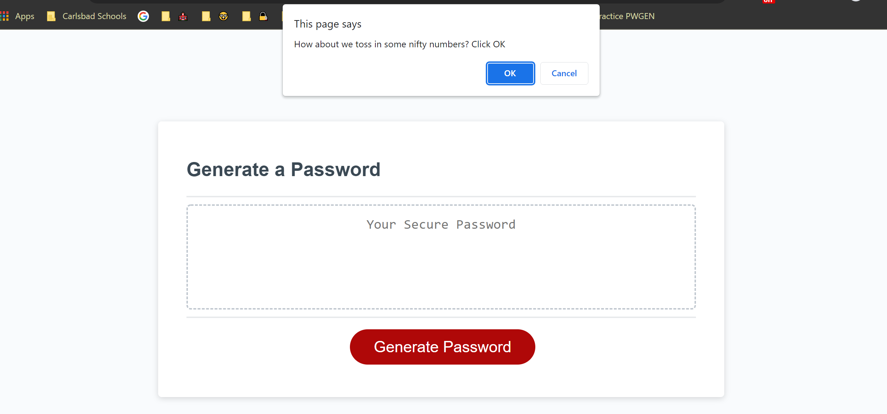
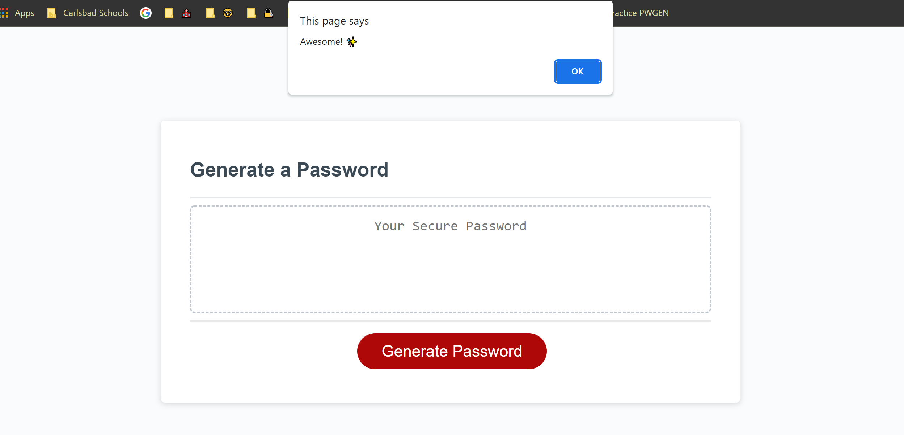

# Password Generator
## Description
This is a password generator that uses prompts, alerts and confirm window boxes. The user can choose the length of their password beteween 8 and 128 characters and decide what they want to include in their password such as upper case letters, lower case, numbers and special characters. This was created to satify a homework requirment for week three of coding bootcamp. It served as a way to put JavaSript skills into practice. Still being very new to JavaScript I found parts of this assignment challenging particulary getting it to choose only the characters chosen by the user. 

## Installation
This project will work on most browsers
[Deployed Link](https://neeta525.github.io/PasswordGenerator_2/)

## Here are a couple screenshots from this project:

#Credits

## Author
- Anita Chavez
- :briefcase: [Portfolio](https://neeta525.github.io/Portfolio25/)
- :octocat: [GitHub](https://github.com/Neeta525)

## Built With:
- HTML
- CSS
- JavaScript

## License

- MIT

